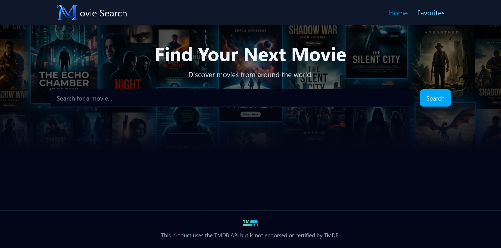
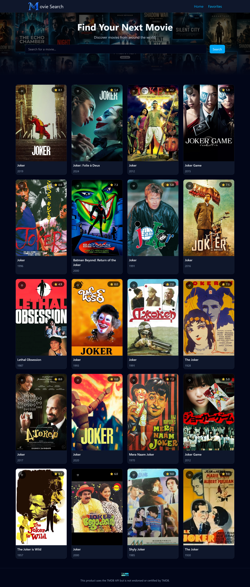
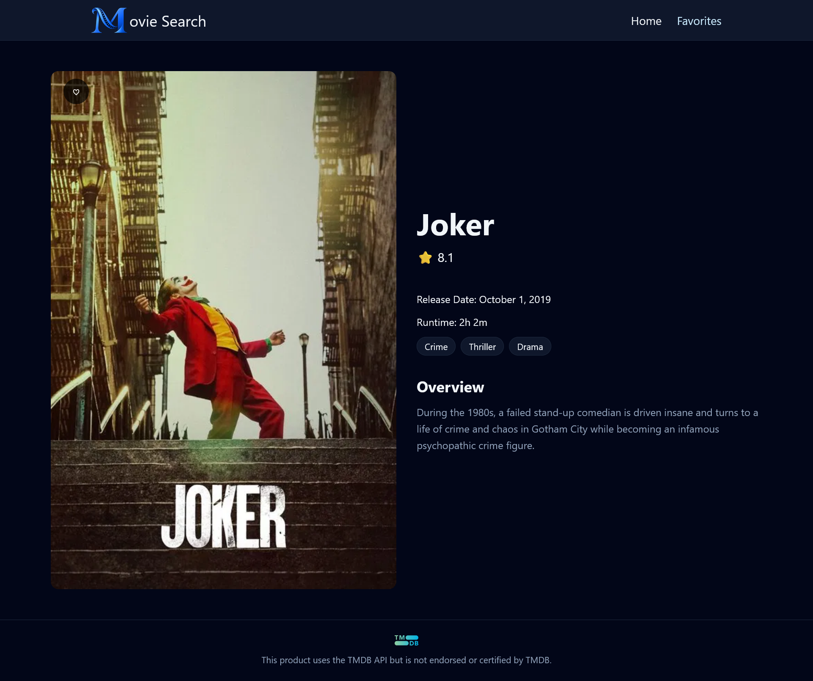
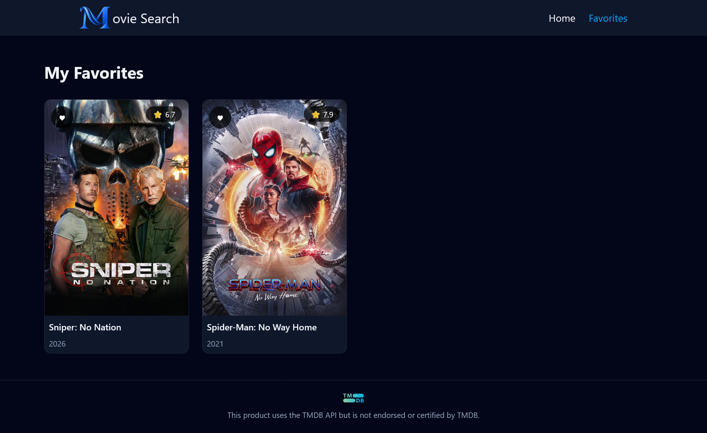

# 🎬 Movie Search

Movie Search is a responsive React application that allows users to search for movies, explore detailed movie information, and save their favorite movies.

The application uses the TMDB API for movie data and includes persistent favorites, session-based search persistence, responsive layouts, accessible keyboard navigation, and client-side routing.

> Built as a portfolio project to apply modern React concepts, API integration, state management, browser storage, responsive design, accessibility, and production deployment.

### 🔗 Links

- **Live Demo:** https://movie-search-app-three-murex.vercel.app/
- **GitHub Repository:** https://github.com/Abilynn/movie-search-app

---

## 📸 Preview



---

## 📖 Project Overview

Movie Search was built to provide a simple and intuitive way to discover movies and save favorites.

Users can search the TMDB movie database, view search results as responsive movie cards, open individual movie details pages, and maintain a collection of favorite movies.

The project goes beyond basic API fetching by handling application state across routes and browser sessions.

Search results are stored temporarily using `sessionStorage`, allowing users to navigate to a movie and return using browser navigation without losing their previous search. Favorites are managed globally with React Context and persisted using `localStorage`, allowing them to survive page refreshes and browser restarts.

---

## ✨ Features

- Search for movies using the TMDB API
- View responsive movie search results
- View detailed information for individual movies
- Add and remove movies from Favorites
- Prevent duplicate favorites
- View saved movies on a dedicated Favorites page
- Persist Favorites using Local Storage
- Preserve the most recent search during the browser session
- Restore search results when returning with browser navigation
- Start a fresh search experience when Home is explicitly selected
- Responsive design for mobile, tablet, and desktop
- Loading, error, empty, and missing-image fallback states
- Keyboard-accessible navigation and controls
- Visible focus states for interactive elements
- Dynamic routing for individual movie pages
- Direct-route support in production

---

## 🛠️ Technologies Used

### Frontend

- **React** — component-based user interface and application state
- **JavaScript (ES6+)** — application logic
- **Tailwind CSS** — responsive styling and design system
- **React Router** — client-side routing and dynamic movie routes
- **Vite** — development and production build tooling

### API & Browser APIs

- **TMDB API** — movie search and movie details data
- **Local Storage** — persistent Favorites
- **Session Storage** — temporary search-state persistence

### Development & Deployment

- **Git & GitHub** — version control and feature-based development workflow
- **Vercel** — production deployment

---

## ⚙️ Technical Highlights

### Shared Favorites State with React Context

Favorites are required across multiple parts of the application, including movie cards, movie details, and the Favorites page.

Instead of storing this state inside individual pages or passing it through multiple levels of props, the application uses a `FavoritesProvider` built with React Context.

A custom `useFavorites` hook provides access to favorites functionality throughout the application.

Duplicate favorites are prevented by checking movie IDs before updating state.

### Persistent Favorites

Favorites are serialized with `JSON.stringify()` and stored in `localStorage`.

When the Favorites Provider initializes, existing data is restored using `JSON.parse()`.

Stored data is validated before being used, and invalid or corrupted Local Storage data safely falls back to an empty Favorites collection rather than crashing the application.

### Session-Persistent Search

The most recent successful search query and its results are stored in `sessionStorage`.

This allows users to:

1. Search for a movie
2. Open a movie details page
3. Use the browser Back button
4. Return to their previous results without repeating the search

Explicitly selecting Home or the Movie Search logo starts a fresh Home experience.

Saved session data is also validated before being restored.

### Dynamic Routing

React Router handles application routes including:

- `/` — Home
- `/favorites` — Favorites
- `/movie/:id` — Movie Details

The movie ID is obtained from the dynamic route and used to request detailed movie information from TMDB.

---

## 📸 Screenshots

### Home


### Search Results



### Movie Details



### Favorites



---

## 🚀 Getting Started

### Prerequisites

Make sure you have the following installed:

- Node.js
- npm
- Git

### Installation

Clone the repository:

```bash
git clone https://github.com/Abilynn/movie-search-app.git
```

Navigate into the project:

```bash
cd movie-search-app
```

Install dependencies:

```bash
npm install
```

---

## 🔐 Environment Variables

This application requires a TMDB API key.

Create a `.env` file in the root of the project:

```env
VITE_TMDB_API_KEY=your_tmdb_api_key
```

The application accesses the environment variable through Vite:

```js
import.meta.env.VITE_TMDB_API_KEY
```

> Do not commit your `.env` file to version control.

---

## ▶️ Running Locally

Start the development server:

```bash
npm run dev
```

Create a production build:

```bash
npm run build
```

Preview the production build locally:

```bash
npm run preview
```

---

## 🧠 Lessons Learned

Building Movie Search strengthened my understanding of how different parts of a React application work together beyond individual components.

Some of the key concepts I practiced include:

- Deciding where application state should live
- Using React Context for state shared across different components
- Creating and using custom hooks
- Working with asynchronous API requests
- Managing loading, error, and empty states
- Using dynamic routes and URL parameters with React Router
- Understanding the difference between React state, Local Storage, and Session Storage
- Serializing and parsing browser-storage data with JSON
- Safely handling corrupted browser-storage data
- Preserving state across navigation without making it permanently persistent
- Designing reusable components such as `MovieCard` and `MovieGrid`
- Building responsive interfaces with Tailwind CSS
- Improving keyboard accessibility and focus visibility
- Preparing a React application for a production build and deployment

---

## 🧩 Challenges & Solutions

### Persisting Search Results Across Navigation

Initially, navigating from search results to a movie details page and returning to Home caused the search results to disappear because the Home page state was recreated.

I solved this by storing the most recent successful search and its results in `sessionStorage`. The saved data is restored when appropriate, allowing browser Back navigation to preserve the user's search while explicit Home navigation starts a fresh experience.

### Persisting Favorites

React state alone meant Favorites disappeared after refreshing the page.

I used `localStorage` to persist the Favorites array and restored it when the Favorites Provider initializes. Defensive parsing and validation were added so corrupted storage data cannot crash the application.

### Direct Route Refreshes After Deployment

Client-side navigation worked correctly after deployment, but refreshing a dynamic route such as `/movie/:id` initially resulted in a Vercel 404.

This happened because React Router handles routes in the browser, while a direct refresh sends the route to the server before React has loaded.

I resolved this by configuring a Vercel rewrite so application routes are served through `index.html`, allowing React Router to handle the requested route after the application initializes.

This reinforced the difference between client-side routing and server-side request handling in a Single Page Application.

---

## 🔮 Future Improvements

Potential improvements for future versions include:

- Migrate the project from JavaScript to TypeScript
- Add automated testing with React Testing Library
- Add component documentation with Storybook
- Add movie filtering and sorting
- Add pagination or infinite scrolling for search results
- Add trending or popular movie discovery
- Add additional movie information such as cast and trailers
- Improve Favorites organization
- Conduct more comprehensive accessibility testing
- Optimize images and application performance

---

## 🎞️ Credits

Movie data and images are provided through the TMDB API.

**This product uses the TMDB API but is not endorsed or certified by TMDB.**

---

## 👩🏽‍💻 Author

**Code Lynn**

Frontend Developer

- **GitHub:** https://github.com/Abilynn
- **LinkedIn:** www.linkedin.com/in/helengbadero
